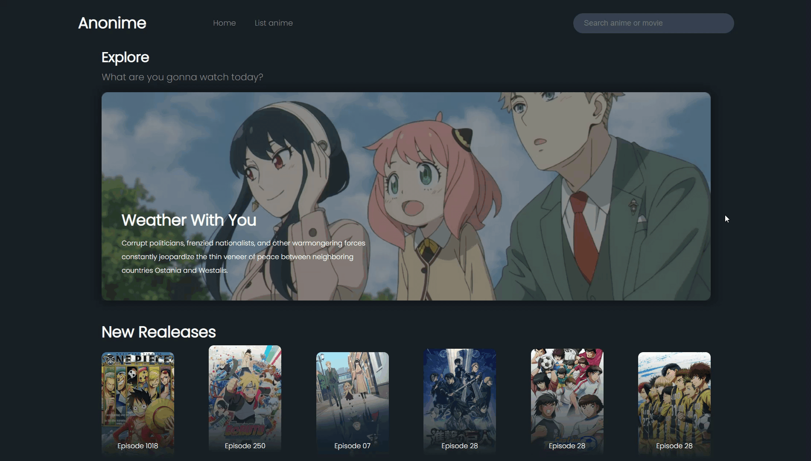

 
 
 

<h1 align="center">
  Music Site
</h1>

 <a href="#-sobre-o-projeto">Sobre</a> •
 <a href="#-layout">Layout</a> • 
 <a href="#-tecnologias">Tecnologias</a> • 
 <a href="#user-content--licença">Licença</a>

## 💻 Sobre o projeto

Anonime - Movie Streaming é um website desenvolvido no Figma por [Rauliqbal](https://www.figma.com/@rauliqbal).

---

## 🎨 Layout

O layout da aplicação está disponível abaixo:

### Web

  

---

## 🚀 Tecnologias

As seguintes ferramentas foram usadas na construção do projeto:

#### **Website**
- [HTML5](https://www.w3schools.com/html/)  
- [CSS3](https://www.w3schools.com/css/default.asp)
- [FIGMA](https://www.figma.com/)
- [VSCODE](https://code.visualstudio.com/)

## 🚧 Projeto

Live Preview: [Visualizar o projeto no navegador](https://anonime-movie-streaming-web.vercel.app/)

## 🎨 Layout:

Figma: https://www.figma.com/community/file/1137701395922980526

## 📝 Licença

Esse projeto está sob a licença MIT. Veja o arquivo [LICENSE](LICENSE) para mais detalhes.

---

Coded com ❤️ por Elvis da Silva 👋🏽 <a class="link__" href="https://www.linkedin.com/in/elvisdasilva">Entre em contato</a>

---
